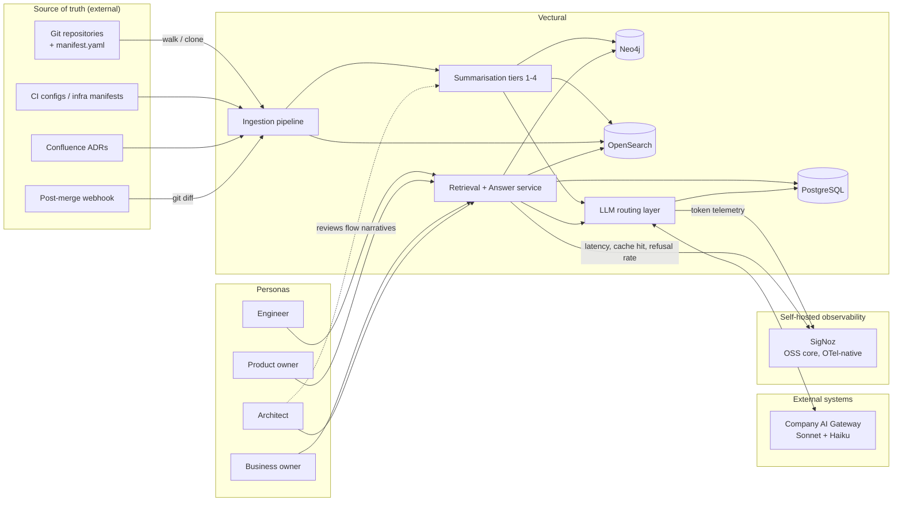
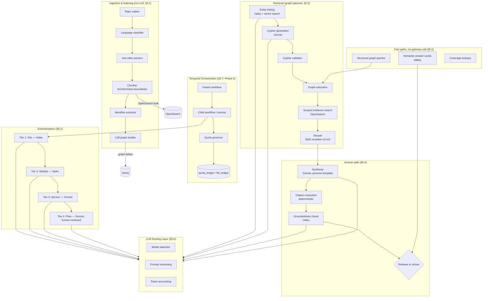
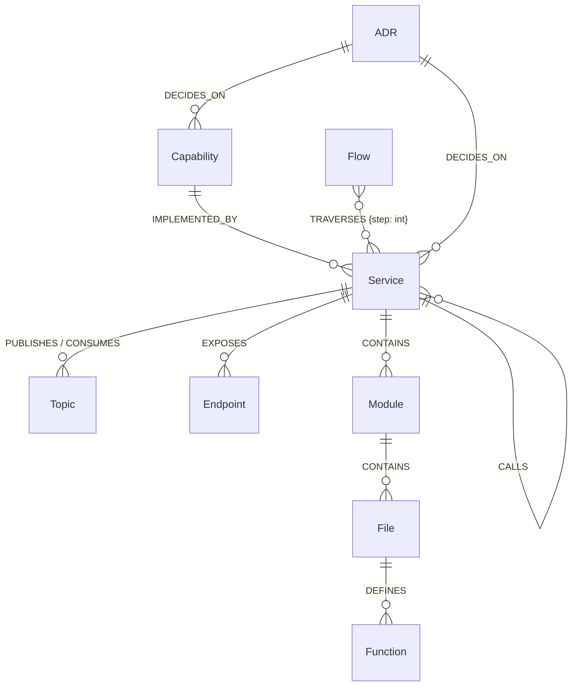
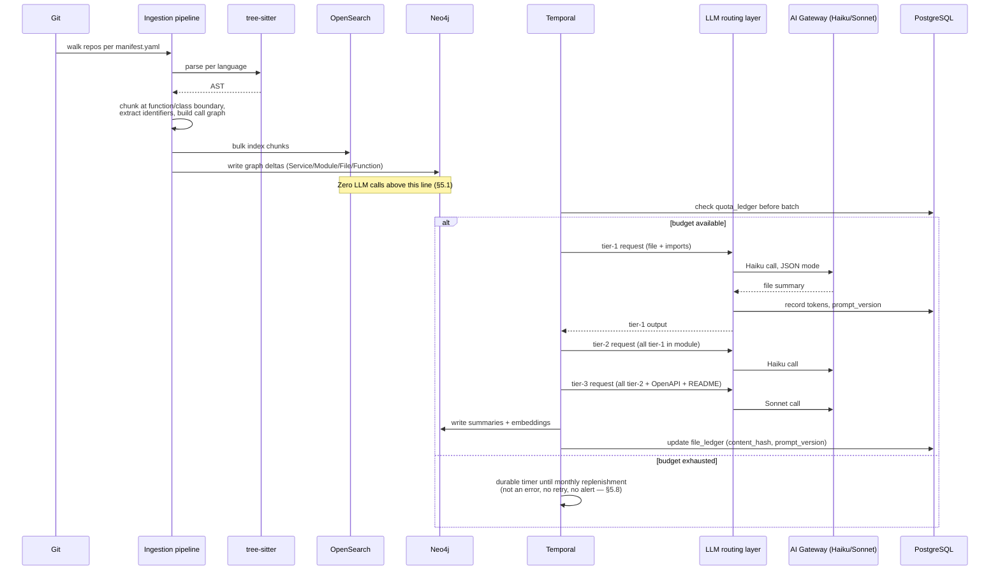
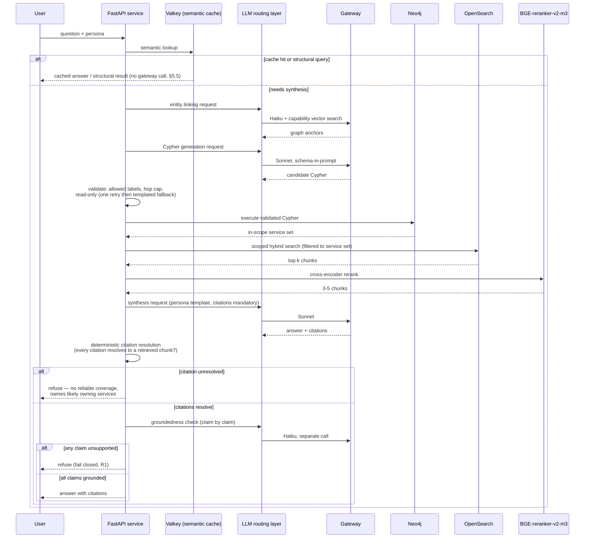
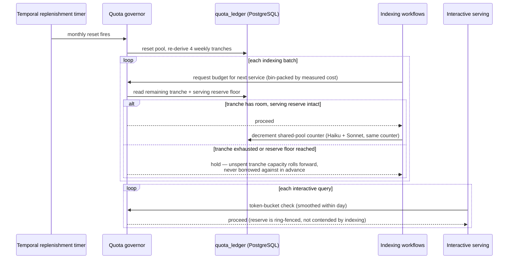
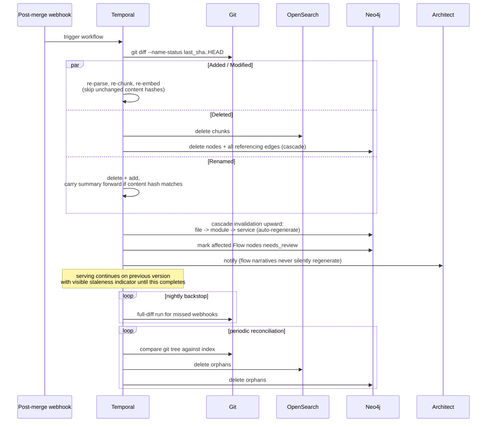
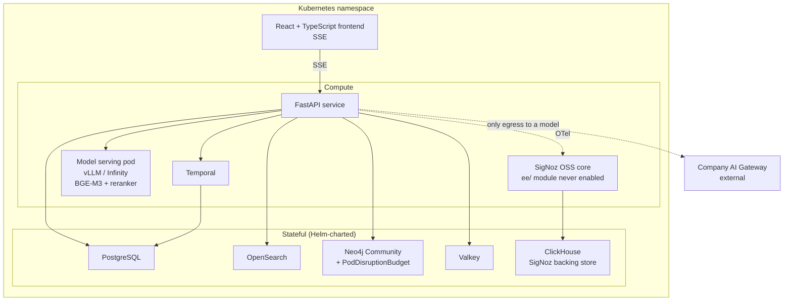

# Vectural — Design Document

**Status:** Draft for review — companion to `implementation-plan.md`
**Purpose:** The implementation plan states *what* must be built, in *what order*, and *why* each constraint exists. This document specifies *how* the pieces fit together: system boundaries, component responsibilities, data contracts, and the run-time behaviour of each cross-cutting flow. Section numbers below reference the corresponding section of `implementation-plan.md` in parentheses, e.g. `(§5.3)`.

Read this document when implementing a component and needing to know its interfaces and neighbours. Read the implementation plan when sequencing work or checking a non-negotiable requirement.

---

## 1. System context

Vectural sits between the engineering estate (source of truth: git + running services) and four human personas. It never writes back to the estate and never serves as a system of record itself — Neo4j and OpenSearch hold **derived, rebuildable** data; PostgreSQL holds the only state that isn't (§4.1).



Two boundaries are load-bearing and must never be crossed by a code path, not just a convention:

- **Model/licence boundary (§2):** the platform has exactly one outbound LLM client (§5.6, §6). Opus never touches this diagram — it operates in a separate workspace with no mount of the codebase, used only to iterate prompts against synthetic samples before they are frozen.
- **System-of-record boundary (§4.1):** Neo4j and OpenSearch are caches over git + PostgreSQL. Any design that makes them harder to rebuild than to query has inverted the intended dependency direction.

---

## 2. High-level component architecture



### 2.1 Component responsibility summary

| Component | Owns | Does not own | Failure mode if wrong |
|---|---|---|---|
| Ingestion pipeline | Deterministic parse/chunk/extract, zero LLM calls | Any judgement about meaning | Bad chunk boundaries corrupt every downstream tier |
| Summarisation tiers | Per-tier prompt, schema, content-hash keying | Retrieval-time decisions | Wrong tier boundary re-triggers full re-spend (§8 risk 1) |
| Temporal orchestration | Durable execution, checkpointing, resumability | Business logic of what to summarise | Non-resumable workflow duplicates spend on restart |
| Quota governor | Single shared-pool counter, tranche pacing, serving reserve | Model selection | Indexing starves interactive users for up to 3 weeks (§8 risk 2) |
| Graph-planned retrieval | Turning a question into a bounded service set | Evidence ranking within that set | Ungrounded Cypher returns wrong or unbounded scope |
| Answer path | Citation-gated synthesis, fail-closed refusal | Retrieval | An unverifiable claim presented as fact — the one requirement that cannot be traded off (R1) |
| LLM routing layer | The *only* egress to any model | Prompt content | A second egress path breaks the licence boundary (§2) irrecoverably |
| Freshness pipeline | Cascade invalidation, reconciliation | Initial ingestion | Stale answers with no visible staleness indicator |

---

## 3. Data model

### 3.1 Neo4j graph schema (§4.2)



**Node property conventions (every node):**

| Property | Type | Purpose |
|---|---|---|
| `commit_sha` | string | Which commit produced this node's current state |
| `prompt_version` | string | Which prompt template produced any derived (summary) content |
| `indexed_at` | timestamp | Staleness display, reconciliation sweep comparisons |

**Vector indexes:** `Capability.embedding`, `Service.summary_embedding`, `Flow.embedding` — all BGE-M3, 1024 dims, used by entity linking (§5.3 step 1).

**Cypher generation constraints (§5.3 step 3):** allowed labels enumerated in the schema-in-prompt; hop cap enforced at validation time, not left to the model; read-only — no `CREATE`/`MERGE`/`DELETE` token permitted in generated Cypher, checked before execution.

### 3.2 OpenSearch chunk index (§4.3)

Index template must exist before any bulk indexing (Phase 1 exit criterion) — the `code_analyzer` cannot be retrofitted onto an already-populated index without a full reindex.

| Field | Analyzer / type | Note |
|---|---|---|
| `content` | `code_analyzer` | word-delimiter-graph tokenisation so `processRefundReversal` matches "refund reversal" |
| `content.exact` | `keyword` | exact-match sub-field |
| `identifiers` | `code_analyzer`, boosted | function/class/variable names |
| `embedding` | `knn_vector`, 1024 dims | BGE-M3 dense vector, hybrid BM25 + k-NN via RRF |
| `service`, `path`, `lines`, `commit_sha`, `language` | metadata | scoping filters applied post graph-plan (§5.3 step 5) |

Reused for ADR and doc chunks with the same mapping, differing only in metadata (`doc_type`).

### 3.3 PostgreSQL — system of record (§4.1, only non-rebuildable store)

| Table | Row represents | Written by | Read by |
|---|---|---|---|
| `repo_state` | Last-processed commit per repository | Freshness pipeline (§5.9) | Ingestion, reconciliation sweep |
| `file_ledger` | Per-file indexing status, content hash, prompt version | Summarisation workflow | Temporal resume logic, coverage manifest |
| `quota_ledger` | Single shared-pool counter across models | LLM routing layer, quota governor | Pacing logic, SigNoz export |
| `answer_cache` | Semantic cache entries (embedding → answer) | Answer path | Fast-path lookup (§5.5) |
| `eval_runs` | Golden-set run results, versioned | Eval harness (Phase 2+) | CI gate |
| `dead_letter` | Content failures for weekly review | Failure taxonomy (§5.8) | Manual review queue |
| `coverage_manifest` | Which services are indexed, at what tier, scheduled when | Quota governor | UI (from Phase 5), refusal path |
| Temporal persistence | Workflow history | Temporal | Temporal |

**Design invariant:** every other store can be dropped and rebuilt from git + this table set. If a new piece of state cannot be reconstructed that way, it belongs in PostgreSQL, not Neo4j or OpenSearch.

### 3.4 Codebase manifest (§4.4)

`manifest.yaml` is the only human-authored mapping from filesystem path to graph node identity. It is reviewed like code, not generated. Every ingestion run reads it before walking; a service directory absent from the manifest is not indexed and does not silently appear in the graph.

---

## 4. Sequence flows

### 4.1 Ingestion → summarisation (Phases 1, 3, 5)



Tier 4 (flow narratives) follows the same router path on Sonnet but terminates in an **architect review workflow** (§Phase 7) rather than automatic release — see §4.4 of this document for the invalidation contract.

### 4.2 Query-time answer path (Phase 6)



This is the enforcement point for **R1 (accuracy cannot be compromised)**: two independent, deterministic-or-separate-call gates sit between synthesis and release. Neither gate is advisory — either can withhold the answer.

### 4.3 Quota governance (§5.7, cross-cutting)



Two invariants this diagram makes explicit:

- **One counter, not one per model.** A Sonnet call and a Haiku call decrement the identical `quota_ledger` row — there is no separate accounting path that could let one model silently starve the other's headroom (§2.1).
- **Tranches never borrow forward.** A week-one overspend cannot be repaid by consuming week-two's allocation in advance; it can only be recovered from that week's own rollover, which is what bounds the blast radius to "this week's indexing pauses," not "three weeks dark" (§8 risk 2).

### 4.4 Freshness / incremental reindex (§5.9, Phase 8)



The asymmetry between automatic (file/module/service) and human-gated (flow) regeneration is deliberate: a flow narrative is a cross-service *business* claim, and re-deriving it automatically on every merge risks silently drifting an architect-reviewed statement without a second review. This is the same fail-closed posture as §4.2, applied to staleness rather than groundedness.

---

## 5. Interface contracts

### 5.1 LLM routing layer (§5.6) — the single egress point

Every call into either model goes through one internal client. Its contract, independent of task type:

```
route(task_type: TaskType, prompt_version: str, payload: dict, persona: Persona | None) -> RoutedResponse
```

| Concern | Contract |
|---|---|
| Model selection | `task_type → model` is a config mapping, not inline logic — swapping Haiku↔Sonnet for a task is a config change, not a code change |
| Prompt versioning | Every call logs `prompt_version`; a golden-set eval run gates any version bump before it can serve traffic |
| Token accounting | Every call emits `{task_type, persona, input_tokens, output_tokens, model}` to `quota_ledger` and SigNoz synchronously — accounting is not best-effort or batched, because the quota governor (§4.3 above) depends on it being current |
| Mode | JSON mode + near-zero temperature for every task type except answer synthesis |

**Hard constraint:** this is the *only* component in the codebase permitted an HTTP client pointed at the gateway endpoint. Any other component that needs model output calls this layer — never the gateway directly. This is what makes the licence boundary (§2) a structural property of the codebase rather than a reviewed convention.

### 5.2 Cypher validation contract (§5.3 step 3)

Input: raw Cypher string generated by Sonnet. Output: `Valid(query) | Invalid(reason)`.

Checks, in order, short-circuiting on first failure:

1. Parses as valid Cypher
2. Every label referenced is in the allowed set from the schema-in-prompt
3. Traversal depth ≤ configured hop cap
4. No write clause (`CREATE`, `MERGE`, `DELETE`, `SET`, `REMOVE`) present

On `Invalid`: one regeneration retry with the failure reason appended to the prompt; a second failure falls back to a templated structural query rather than surfacing the error to the user.

### 5.3 Citation contract (§5.4)

Synthesis output is not free text — every claim-bearing sentence carries a citation to a specific retrieved chunk (`chunk_id`). The citation resolution check is **deterministic code, not a model call**: it verifies each `chunk_id` referenced in the answer appears in the set of chunks actually passed to synthesis. This runs before the groundedness check (a Haiku call) — cheaper and stricter first, so a malformed citation never spends a second gateway call.

### 5.4 Coverage manifest read contract (§5.8, §Phase 5)

Consumed by both the UI and the refusal path — the same source of truth, so a user asking about an unindexed service gets the same answer ("not yet indexed, scheduled week N") whether the system just returned a raw retrieval or fell all the way through to refusal. Prevents the two surfaces drifting into contradictory statements about coverage.

---

## 6. Deployment view



Neo4j runs single-instance Community edition (§3, licence table) — the mitigation for the resulting availability risk (§8) is architectural, not operational: the graph is derived data, so the response to an outage is a rehearsed rebuild from git + PostgreSQL, backed by snapshots and a PodDisruptionBudget, rather than an HA topology the Community edition doesn't offer.

**Licence note:** SigNoz's core is MIT-licensed; its `ee/` folder is a separate proprietary enterprise module and must never be deployed — the same open-core boundary already accepted for Neo4j Community (§3). ClickHouse (Apache 2.0) is SigNoz's backing store; it holds only operational telemetry (traces, metrics, logs), not RAG knowledge data, so it is intentionally excluded from the store-responsibilities table in §3.3 — that table is scoped to stores holding retrievable platform knowledge, not observability infrastructure.

---

## 7. Cross-cutting concerns

### 7.1 Observability

Every component that spends tokens or serves a query emits to SigNoz via OpenTelemetry: token spend by persona and task type (from the routing layer, §5.1), retrieval latency percentiles, refusal rate, cache hit rate, and coverage percentage (Phase 8 dashboards). Because quota pacing (§4.3) depends on the token figures being current, this telemetry path is a correctness dependency, not a monitoring nicety — a lagging counter would let indexing overspend before the governor could react.

### 7.2 Failure taxonomy (§5.8)

The design encodes three qualitatively different failure classes with different responses, and conflating them is the risk to design against:

| Class | Design response | Anti-pattern to avoid |
|---|---|---|
| Quota exhausted | Durable Temporal timer; no retry, no alert | Treating it as an error and paging someone — it's an expected, planned-for state |
| Transient gateway | Temporal retry policy, exponential backoff | Silent swallow — must still surface in token accounting even on eventual success |
| Content failure | Dead-letter to Postgres, continue, weekly review | Blocking the whole batch on one malformed file — atomicity (§5.7) is per-service, not per-batch |

### 7.3 Security / licence boundary

Restated because it is the one boundary a design review must actively check rather than assume: verify, for any new code path touching an LLM, that it routes through §5.1 and never constructs its own client against a personal endpoint. This is the kind of property that is cheap to preserve by construction (one client class) and expensive to audit for after the fact (grep every HTTP call site).

---

## 8. Requirements traceability

| Requirement (§1.2) | Enforced by |
|---|---|
| R1 — Accuracy cannot be compromised | Citation contract (§5.3 here), groundedness gate (§4.2 sequence), fail-closed refusal, eval gating (§7.1 of implementation plan) |
| R2 — Cross-service aggregation | Graph-planned retrieval (§4.2 sequence, steps entity-linking → Cypher → execution) |
| R3 — No stale data | Freshness sequence (§4.4 here), cascade deletes, reconciliation sweep, staleness indicator |
| R4 — Fully open-source stack | Deployment view (§6 here); every stateful component OSI-licensed |
| R5 — Constrained gateway quota | Quota governance sequence (§4.3 here), single shared-pool counter, tranche pacing |
| R6 — Four personas | Persona parameter threaded through routing layer (§5.1 here) and synthesis template (§4.2 sequence) |

---

## 9. Open design items

These are design-level (not scheduling-level — see implementation plan §9 for those) points a reviewer should weigh in on before Phase 3:

1. **Cypher validator implementation** — hand-rolled AST check against the Cypher grammar vs. a constrained-generation approach (grammar-constrained decoding) that prevents invalid Cypher at generation time rather than catching it after. The retry-then-fallback design (§5.2 here) assumes the former; revisit if Sonnet's raw validity rate in Phase 3 calibration is too low to make two attempts sufficient.
2. **Semantic cache invalidation** — the answer cache (§5.5 of implementation plan) is keyed on embedding similarity, not exact match; its invalidation on freshness events (§4.4 here) is not yet specified — a cached answer citing a since-deleted chunk must not survive a cascade delete.
3. **Coverage manifest granularity** — currently service-level (§5.4 of implementation plan lists it as a table, not a schema). Whether it needs tier-level granularity (a service fully chunked but only tier-1 summarised) affects both the UI and the refusal path's wording.
